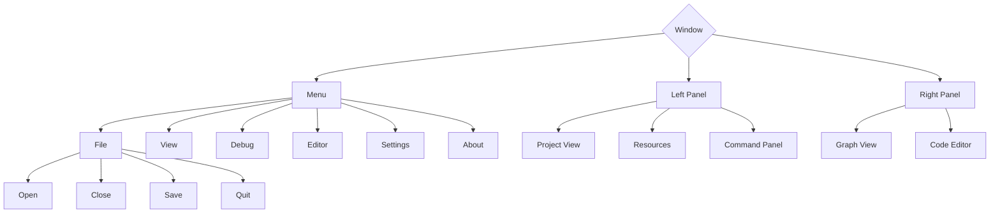

# Back Story

Anvie is building it's own GUI library after trying some already present libraries in the market. There are different reasons for each library to be rejected from our choice. Some have :
- good structure, but lack features
- many features but lack any type of structure
- has both good features and many features but lack a good and less restrictive license

... and there are many but these are what came out from top of head. We prefer a retained mode GUI over an immediate one for some other things that we're planning in future. 

## Expectations

We obviously don't aim for our GUI lib (we call it **Urumi**), to be full of features, but we aim for :
- presence of required features (like good looking and working widgets, cross-platform etc...)
- a well structured library with plug and play type design, and 
- best performance that we can extract from it. 

One thing we don't want to compromise is with performance. We want to make best design decisions that lead to optimal performance, but also maintaining a balance towards maintainability and usability.

# Current Desgin Decisions

**Urumi** (pronouced : **ou-ru-me**) is using `Vulkan` for rendering it's UI. We've seen that popular GUI libraries provide same look and feel across any platform then render on. Take Qt and DearImGUI for example. They both are quite good in what they do!

## The Graphics Module

Alongside our `UI` module, we're working on our `Graphics` module that'll support both 3D, and 2D rendering as well as rendering the UI itself on top. The current aim is to desgin the Graphics module in such a way that it can completely hide the Vulkan layer from User Application and allows 3D rendering from the start without much bootstrap code (30-40 lines). If needed, User Application can create it's own renderer instance and get access to all already setup Vulkan objects and then make it's own choices regarding rendering.

### Choice Of Rendering API

Well obviously, this needs to be Vulkan. With modern rendering APIs like Vulkan, Metal, D3D13 etc... in market, you have to be up to date with technology. While using APIs like OpenGL would've been a lot easier, we find it hard to convice ourselves to use it. Moral issues again!


This is our first triangle rendered in Urumi. It took around 1400 lines of code just to draw this properly! It can be done in about half of that, but whats the fun in that 😁?

### Choice Of Language

Development began sometime around May 20th, 2023 and Graphics module will get very radical changes before this year end. We first decided to use `C` to create Urumi but we hit some barrier and moral issues after a few weeks. The fact  that our core developer [@brightprogrammer](https://github.com/brightprogrammer) didn't like is that pointers aren't type safe, so when creating arrays you always have to keep track of what type of pointer it is. Some libraries manage this problem very well but we had to make a choice and we chose `C++`. Between having to bootstrap Vulkan and choosing to write a new typesafe containers (yes we found a very hacky and poorly maintainable solution), we chose to focus on setting up Vulkan first.

Although, one thing we crave is lesser build time, but we obviosuly can't have everything we need at one place. It takes around 2-3 minutes to finish our workflows file!

### Renderer Structure

Like others, we also started with simple `VulkanHelloTriangle` application by following tutorials available on sites and help from servers :
- [vulkan-tutorial](https://vulkan-tutorial.com) by [Alexander Overvoorde](https://github.com/Overv)
- [vkguide](https://vkguide.dev) by [V. Blanco](https://github.com/vblanco20-1/)
- [Official Vulkan Discord](https://discord.gg/JZxUu6gysM)

But now the Renderer class's structure is bit more complex. There are lots of things to be changed

We have separate classes/structs for basic Vulkan handles :
- `VkInstace` is wrapped into a global singleton object `Instance` with lazy initialization. Once you call `Instance::Get()`, if wrapped vulkan handle is `VK_NULL_HANDLE` (i.e, not yet created) then it's created and a `VkInstance` will be returned. But that's also being wrapped around to increase ease of use.

Something like :
```c++
struct Instance {

    /**
     * Get Vulkan Instance.
     * @return Created Vulkan Instance.
     * */
    static FORCE_INLINE VkInstance Get() {
        if(mh_instance == VK_NULL_HANDLE) {
            Create();
        }

        return mh_instance;
    }

private:
    // cannot be constructed or destroyed
    Instance() = delete;
    Instance(const Instance&) = delete;
    ~Instance() = delete;
};
```

- `VkPhysicalDevice` is wrapped into `Gpu` which provides easy interface to query information like memory properties, device features etc...

- `VkDevice` is wrapped into `Device`. It's main goal is to provide a nice interface for device memory management. For the moment it supports creating device buffers and uploading that vertex data to device buffers.

- `VkSwapchainKHR` is wrapped into `Swapchain` that'll store swapchain images and provide interface to control properties like double or triple buffering, begin and end rendering, clear images etc... 

So, for example, when recording rendering commands into VkCommandBuffer, we can do something like : 

```c++
void Renderer::Draw(const RenderPass& rp, const Device::Buffer& db, Size num_vertices) {
    Uint32 image_idx;
    VkCommandBuffer h_cmd;
    
    // begin rendering
    if(!m_swapchain.NextFrame(image_idx, h_cmd)) {
        RecreateSwapchain();
    }

    /* record your draw commands here.. */
    /* begin renderpass */
    /* bind pipelines, vertex data, uniforms etc... */
    /* draw */
    /* end renderpass */

    // ende frame and submit for presentation
    if(!m_swapchain.EndFrame(image_idx, h_cmd) || mb_window_resized) {
        RecreateSwapchain();
    }
}
```

- `VkPipeline` and `VkPipelineLayout` is wrapped around `Effect` that takes multiple `VkShaderModule`(s) wrapped around `Shader` structs. This however might change hugely in future so I won't desribe it here.

- `VkRenderPass` is wrapped around `RenderPass` that takes multiple `Subpass` structs. All information is first provided to RenderPass before submitting it to Renderer for `VkRenderPass` creation. Each `RenderPass` get's their own set of `VkImageView` handles and `VkFramebuffer`. This design seems quite intuitive at the moment, but it might also change in future so I won't be describing it here.

## The Event System

The main goal of this post is to describe the Event system. Why? Well because :
- [@brightprogrammer](https://github.com/brightprogrammer) is building this for the first time, so design ideas are important. You don't get to create and talk about new stuffs everyday!
- advocated a lot about our design choices to some experienced devs in a discord server
- we need to keep track of our design decisions.
- in future if we change our design implementation, we need to be able to show why we did that.

### What Are Events?

Events are like notifications you recieve on your phone or desktop. When you get a notification, you either react to it or you let it pass. Whatever you do, it depends on you (the event handler) and not on the notification sender app (the event dispatcher)

### Why Events?

When rendering UI using a Rendering API, you can choose either to constantly keep drawing to screen (Immediate Mode Rendering) or you can choose to render and upadte only necessary parts of screen only when user interacts with your application in some way (user generates events!). This is called Retained Mode Rendering. There is more to it, however, this should be enough to get started.

So for eg: In when you render all the time, non stop, your event dispatcher loop looks like this : 
```c++
int main() {
    Bool b_running = true;
    Event event;
    while(b_running) {
        while(GetEventFromQueue(event) != 0) {
            // keep getting events and processing them one by one
            if (event.type == Event::Type::Quit) {
                b_running = false;
            }
        }
        
        DrawUi();
    }
}
```

This loop is always active and will keep your CPU as well as GPU busy all the time. While this is the technique opted by Games and nowadays Game Engines too! This can be relatively more power consuming. There's also no distinction between events and handlers, everything is handled as soon as it happens. This can be responsive! Yes! This too can be separated into event handlers and dispatchers however!

In a retained mode UI, you don't process event when user is not interacting with the window. In above example, `DrawUI()` will be called whether or not user is interacting with the window or not (which is required in games because they need to keep updating world no matter what). A retained mode render loop might look like this :
```c++
int main() {
    Bool b_running = true;
    Event event;
    while(b_running) {
        // this can be blocking the main thread
        // if there's no user interaction
        if(GetUserCurrentInteraction(event)) {
            // keep getting events and processing them one by one
            if (event.type == Event::Type::Quit) {
                b_running = false;
            }
        }
        
        DrawUi();
    }
}
```

Due to just that one change, in blocking vs non-blocking of main thread, rendering approach changes. Usually a Retained Mode UI also maintains a View-Tree that's used to diff between previous view tree and new view tree whenever there's a view change. If two view tress differ by a large amount they need to be redrawn completely! But only when it changes! 

Example of a view tree (not complete) :



One more reason for using events rather than handling all in same while loop is because it allows separation of handler code from dispatcher code. This separation allows the Events system to be extendable by other types of events. This can be any type of event :
- A new device is attached to host
- A new user connected to your server
- Someone clicked a button 
- User trying to close the application and you don't want the application to be closed because you are EVIL! XD
... and so on...

We want handling and dispatching of events to be extendable. This will also allow us to dispatch events from anywhere in the program and not just in the dispatch loop!

### Event Handler Tree

Just like view tree, there's an event handler tree in Urumi. It's created automatically so you don't need to worry about that! You don't even need to write code for this tree.

Event handler tree is exactly like view tree. The only major difference is the fact that event tree, triggers events and view tree will trigger `DrawUi` method of it's children. This way a parent gets to decide whether it's child will handle an event or draw itself and it's children onto screen or not.

### Event Manager Class

To be able to handle an event, a handler function requires some data. For this data to be passed around, we can either create a huge monolothic `EventData` data structure with lots of unions of data structures of different types or we can seggregate different event types into different event structures. We chose the latter approach because that's the one which sounds more modular and maintainable to us. 

This has some barriers though. Since data structure containing event data is different for each event type, their handler function signatures will also differ.

```c++
// for a WindowEvent
// Signature is void(Window::**)(const WindowEvent&)
void Window::OnResize(const WindowEvent& w) {
    UpdateSize(w.width, w.height);
}

// for a KeyboardEvent
// Signature is void(Frame::**)(const KeyboardEvent&)
void Frame::OnKeyDown(const KeyboardEvent& k) {
     if(IsQuitKey(k.key)) {
         Shutdown();
     }
}

// and so on...
```

Notice that not only event type is changing in parameter, but also the class is changing. To handle this we had to implement a template class that can cover these cases :

```c++
template<typename EventT>
struct EventManager {
    /// store event ID type in given EventT
    typedef typename EventT::ID EventID;

    /// define Internal event Handler function Type
    typedef std::function<void(const EventT&)> IHandlerT;

    /**
     * Manager Function
     * @param event Dispatch given event to corresponding handler.
     * */
    inline void Dispatch(const EventT& event) {
        // get beginning and ending iterator for bucket with given id
        auto id_bucket = mumap_handlers.bucket(event.id);
        auto beg = mumap_handlers.begin(id_bucket);
        auto end = mumap_handlers.end(id_bucket);
        // dispatch event to all event handlers in the bucket
        while(beg != end) {
            beg++->second(event);
        }
    }

    /**
     * Connect given listener and handler to event dispatcher.
     *
     * @tparam ListenerT Type of derived @c EventListener object.
     * @tparam EHandlerT External Handler Type, i.e. type-signature
     * of function without ListenerT object bound to Event Handler.
     *
     * @param id Event::ID to connect against.
     * @param fn_handler External event handler function. By External we
     * mean the fact that initially we only have address and signature of
     * function and the function itself is not bound to the actual listener.
     * */
    template<typename ListenerT>
    void Connect(EventID id, void (ListenerT::*pfn_handler)(const EventT&), ListenerT& listener) {
        // bind event handler with it's listener
        IHandlerT fn_listener_bound_handler = std::bind_front(pfn_handler, &listener);
        // register to parent event dispatcher
        mumap_handlers[id] = fn_listener_bound_handler;
    }

private:
    // this map here results in a tree like dispatch system
    std::unordered_map<typename EventT::ID, IHandlerT> mumap_handlers;
};

#define ADD_EVENT_MANAGER(m) \
    using m::Connect;      \
    using m::Dispatch;     \
```

To connect to an event of specific type, you call `Connect(...)` and to dispatch an event to your children, you call `Dispatch(...)`.

### How To Create A New Event Type?

Let's create a new event called `WindowEvent`. First we'll define the data structure that'll contain the event related data.

```c++
/**
 * Represents a WindowEvent
 * a single Window Event.
 * Contains data required for processing
 * */
struct WindowEvent {
    /**
     * Convert @c SDL_WindowEvent to self type.
     * @param we @c SDL_WindowEvent.
     * */
    WindowEvent(const SDL_WindowEvent& we) {
        id        = static_cast<WindowEvent::ID>(we.event);
        id_window = we.windowID;
        width     = we.data1;   // can also be treated as xpos
        height    = we.data2;   // can also be treated as ypos
    }

    enum class ID {
        None           = SDL_WINDOWEVENT_NONE,
        Shown          = SDL_WINDOWEVENT_SHOWN,
        Hidden         = SDL_WINDOWEVENT_HIDDEN,
        Exposed        = SDL_WINDOWEVENT_EXPOSED,
        Moved          = SDL_WINDOWEVENT_MOVED,
        Resized        = SDL_WINDOWEVENT_RESIZED,
        .
        .
        .
        DisplayChanged = SDL_WINDOWEVENT_DISPLAY_CHANGED,
        MAX
    };

    /**
     * Event type or EventID.
     * */
    ID id;

    /**
     * Parent window processing this event must check whether
     * the window ID matches with it's SDL_Window instance ID.
     * */
    WindowID id_window;

    // width or x-position when window position is changed
    union {
        Uint32 x;
        Uint32 width;
    };

    // height or y-position when window position is changed
    union {
        Uint32 y;
        Uint32 height;
    };
};
```

Then to create a new event manager corresponding to this event type, we just need to do a typedef (optionally).

```c++
typedef EventManager<WindowEvent> WindowEventManager;
```

Just that! Now we have our new event handler type. Now to make a class handle this event we just need that class inherit from this class, and guess what? C++ allows multiple inheritance so, one single class can handle different event types at the same time using this approach.

So, if we were to create a `Window` struct to represent a window on scree, and we want it to handle different event types, we can do something like this : 

```c++
    struct Window : public WindowEventManager,
                    public KeyboardEventManager,
                    public MouseEventManager,
                    public Drawable
    {
        /**
         * Create a new application.
         * @param name Window title.
         * @param width Initial width of application.
         * @param height Initial height of application.
         * */
        Window(const String& name, Uint32 width, Uint32 height);

        /**
         * Destroy this window.
         * */
        ~Window();

        void GetSize(Uint32& w, Uint32& h);
        void SetSize(Uint32 w, Uint32 h);
        void GetName(String& name);
        void SetName(const String name);

        void Clear(const Vector4f& col) { m_renderer.ClearSurface(col); }

        void AddFrame(Frame f);
        void RemoveFrame(Frame f);

        Mesh2D m = {};

        // Event Handlers
        void OnResize(const WindowEvent& w);
        void OnKeyDown(const KeyboardEvent& k);
        void OnMouseMotion(const MouseEvent& m);

        FORCE_INLINE void RefreshUi() {
            // clear and draw first frame
            Clear(GetBackgroundColor());
            DrawUi();
        }
    private:
        FORCE_INLINE void DrawUi() {
            m_renderer.Draw2D(m);
        }

        // private data...
    };
```

### Connect And Dispatch

We don't have many widgets in Urumi at the moment, but as an example, this is how `Ui::Window` class registers it's event handlers to a class that represents the Main Application  :

```c++
// in main.cpp
struct Urumi : public Ui::Application {
    Urumi() : Application(String("UrumiTestApp"), UR_VERSION(0, 0, 0)),
              win("Urumi", 800, 600)
    {
      
        // connecting to different event handlers
        // of different signature!
        Connect(KeyboardEvent::ID::KeyDown, &Ui::Window::OnKeyDown, win);
        Connect(WindowEvent::ID::Resized, &Ui::Window::OnResize, win);
        Connect(MouseEvent::ID::Motion, &Ui::Window::OnMouseMotion, win);

        win.SetBackgroundColor(Vector4f(4.f/255, 0.f/255, 9.f/255, 1));

        win.RefreshUi();
    }
private:
    Ui::Window win;
};
```

There's no benchmark for this system for the moment, but we sure plan to release once Urumi get's some good amount of widgets.

## Future Ideas

- We're considering Functional Reactive Programming (FRP) Design. From what we can see at the moment, it's supposed to be asynchronous from the starts and that's a very good thing to have.
- Try to provide synchronicity here also. Right now, if an event handler will take some time, it'll be noticable! Asynchronous handlers will be non blocking.
- We'll try implementing other systems from suggestions we got, and try to benchmark them and compare with what we already have.

There will soon be a detailed post on our Graphics module too. Hang tight with us! Great things are coming! They'll surely take time!
