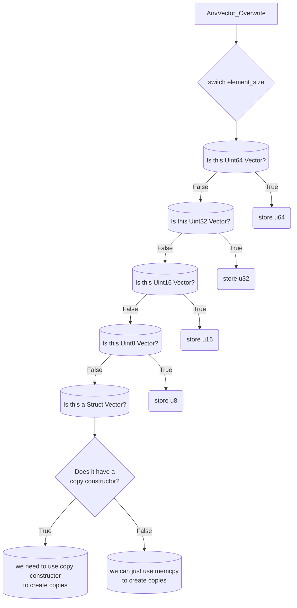

| Date           | Author           |
|----------------|------------------|
| 15th July 2023 | Siddharth Mishra |


If you're developing a library, having tests verify your API can code before you release your code to public! or use it as a dependency in some other project.

# Write Tests For More Coverage!
I watched a YouTube video today to learn more about unit tests. Learned some important things from it.

While writing tests for `AnvVector`, I just realized one thing. The whole purpose of Unit Tests is to gain more code coverage for each separate unit. I'll explain by giving example of `AnvVector` itself.

`AnvVector` aims to be a typesafe, generic vector in C. To create typesafe arrays, I use macros. This is not as typesafe as other higher level languages but adds a certain level of ease of use and safety to basic code without the macros. 

To create generic arrays, I use pointers to pass structs in API functions, but at the same time, this pointer can also hold 64 bit values. So I'm using it to store any value that's less than equal to 64 bit too! It's kind of messy when you try to use the raw API, but with helper macros, you won't feel anything odd about it's external working. To resolve to different type of values, I internally keep track of the size of element. Here's the code for `AnvVector_Overwrite` function that can be used to write at any position in `AnvVector` :

```c
/**
 * Move an element between two positions.
 * This will automatically destroy element where data is to be
 * overwritten before writing anything.
 *
 * @param p_vec
 * @param pos Position where this new data
 * @param p_data Data to be moved
 * */
FORCE_INLINE void AnvVector_Overwrite(AnvVector* p_vec, Size pos, void* p_data) {
    RETURN_IF_FAIL(p_vec && (pos < p_vec->capacity), ERR_INVALID_ARGUMENTS);

    Uint64 value = (Uint64)p_data;
    switch(AnvVector_ElementSize(p_vec)) {
        case 8 : AnvVector_At(p_vec, Uint64, pos) = (Uint64)value; break;
        case 4 : AnvVector_At(p_vec, Uint32, pos) = (Uint32)value; break;
        case 2 : AnvVector_At(p_vec, Uint16, pos) = (Uint16)value; break;
        case 1 : AnvVector_At(p_vec, Uint8, pos) = (Uint8)value; break;
        default : {
            if(p_vec->pfn_create_copy) {
                void* p_elem = AnvVector_AddressAt(p_vec, pos);
                if(pos < p_vec->length) p_vec->pfn_destroy_copy(p_elem);
                if(p_data) p_vec->pfn_create_copy(p_elem, p_data);
                else memset(p_elem, 0, p_vec->element_size);
            } else {
                void* p_elem = AnvVector_AddressAt(p_vec, pos);
                if(p_data) memcpy(p_elem, p_data, AnvVector_ElementSize(p_vec));
                else memset(p_elem, 0, AnvVector_ElementSize(p_vec));
            }
        }
    }
}
```
Notice how it's converting pointer to a `Uint64` value and then storing data inside array.

Ok, so now we need to test this API, or atleast other APIs using this one. In that case, as I said, Unit Tests must have as much coverage as possible. To do this I realized the following idea : 

> To have a good coverage, you need to create tests corresponding to each branch in the code you're testing

Here, allow me to explain. Consider the control flow graph of this method :



Each cylinder represents a single unit test case that we need to test. Notice the branches and control flow. By getting more coverage, we mean most of these branches will be executed in testing phases. To explain it in more layman terms :
- Consider your program has 1000 CPU instructions
- If the tests you write cover only say 700 instructions. (Only 700 instructions out of 1000 insns. get executed)
- In above case, we say you get 70% code coverage.
- This means 30% of your code remains untested.
- This 30% of your code
  - Might contain severe bugs
  - Might fail when given certian inputs
- More importantly, when this goes on for long, this code might cascade some other bugs and
  - Make debugging program lot harder
  - Tests might not be precise due to this 30% code failing other tests in future


So when I'm writing tests, I need to test for each of these units. Now, since the `UintNN` branches behave much similarly so I believe if we just mix their use while writing tests, it'll cover all of them. Then other units we need to write tests for are these last two units. When array has to use a copy constructor to create a copy of element and store it internally, or when it can just do `memcpy`.

## Write Tests With Data You Know! No Use of `rand()`!!
Searching mindlessly on YouTube about something interesting to watch, I came across this awesome video that covers some points on how to write **GOOD** unit tests. This post covers only the parts I realized today while writing tests (as the title states).

<center>
<iframe width="720" height="480" src="https://www.youtube.com/embed/fr1E9aVnBxw?start=439" title="YouTube video player" frameborder="0" allow="accelerometer; autoplay; clipboard-write; encrypted-media; gyroscope; picture-in-picture; web-share" allowfullscreen></iframe>
</center>

Eliotte here mentions that you must always try to use known values instead of using `rand()`, in your tests. So, here's a small story for you : 
- While writing tests, 2 tests were failing
- After watching this video, I replaced `rand()` with direct iterated values (generated in a loop)
- I get 3 failing tests!

Why? This had to do with my `AnvVector` API. I treat pointers as integers sometimes and sometimes I treat them as normal pointers to structured data. This needs testing because while implementing the API functions, I was constantly changing other APIs too, and this idea of using of `void*` as integer values came through that evolutionary process! This significant change means that `NULL` pointers are valid values to be inserted into `AnvVector`(s) and `rand()` rarely returns 0, therefore this extra test wasn't failing at that time and as soon as I removed `rand()` with normal iterated values, 0 was in that list and test started failing.

# Test All APIs Irrespective Of Size

Consider these two functions : 

```c
/**
 * Insert an element into @c AnvVector.
 * This will insert element at position by creating space.
 * This means order of array will be preserved before and after
 * insertion.
 *
 * @param p_vec
 * @param p_data Pointer to memory or just the value to be inserted into
 * contiguous array maintained in @c AnvVector.
 * @param pos Position where insertion will take place.
 * */
FORCE_INLINE void AnvVector_Insert(AnvVector* p_vec, void *p_data, Size pos) {
    RETURN_IF_FAIL(p_vec, ERR_INVALID_ARGUMENTS);

    // resize array if insert position is more than capacity
    if(pos >= p_vec->capacity) {
        // calculate new allocation capacity if required
        Size new_capacity = p_vec->capacity;
        while(pos >= new_capacity) {
            new_capacity = p_vec->capacity * (1 + p_vec->resize_factor);
        }

        // reallocate if we need to
        void* p_temp = realloc(p_vec->p_data, new_capacity * AnvVector_ElementSize(p_vec));
        RETURN_IF_FAIL(p_temp, ERR_OUT_OF_MEMORY);
        p_vec->p_data = p_temp;
        p_vec->capacity = new_capacity;
        p_vec->length = pos;
    }

    // resize array if insert position is in between but array is at capacity
    if(p_vec->length >= p_vec->capacity) {
        Size new_size = p_vec->capacity * (p_vec->resize_factor + 1);
        void* p_temp = realloc(p_vec->p_data, new_size * AnvVector_ElementSize(p_vec));
        RETURN_IF_FAIL(p_temp, ERR_OUT_OF_MEMORY);
        p_vec->p_data = p_temp;
        p_vec->capacity = new_size;
    }

    // shift elements to create space
    Size shift_index = p_vec->length;
    while(shift_index > pos) {
        Size next = shift_index; // at the starting of loop, this is index of position just after last element
        Size prev = --shift_index; // at the starting of loop, this is index of last element

        // NOTE Copy operation might be slow for struct arrays
        AnvVector_Copy(p_vec, next, prev);
    }

    // insert
    AnvVector_Overwrite(p_vec, pos, p_data);

    p_vec->length++;
}
```

```c
/**
 * Push an element to front by preserving order.
 * @param p_vec
 * @param p_data
 * */
void AnvVector_PushFront(AnvVector* p_vec, void* p_data) {
    RETURN_IF_FAIL(p_vec, ERR_INVALID_ARGUMENTS);
    AnvVector_Insert(p_vec, p_data, 0);
}
```

Now, at first sight, you might feel like if we just test the `Insert` method, then we'll cover this `PushFront` case too! but that's not the case. This function is reason for one of those 2 failing tests! Yes! Reason is that it's always inserting elements at 0, that that specific case wasn't tested when testing `Insert` method! Writing a test for a function as small as this one too found a bug for me and saved me hours and days of development time!

# Ending Notes
There are lots of things I'll learn now. I'll keep adding them as reference here. Next, I'll be integrating this with `AnvieFile` after I finish writing tests for struct based arrays with copy and without copy constructors.

Ciao ciao!
